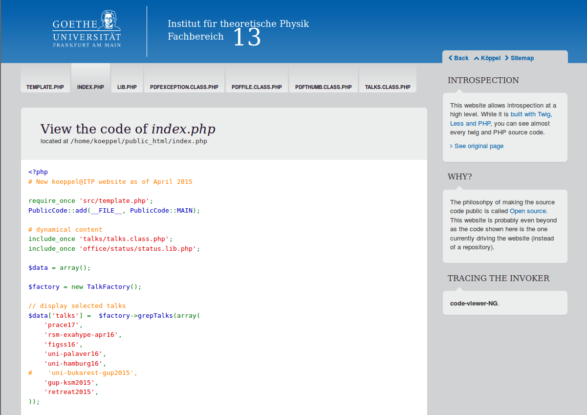

# PublicCode: Life PHP code browser integrated into the website

PublicCode is a small framework to expose the PHP code of a website to the user.
This allows a visitor to easily inspect the server side code which created the HTML
she views. Embedded in a website, the viewer can look like this:

The screenshot shows a dynamically created website with a code viewer and a
navigation bar to switch between the generating sources for a given website. The
user can also switch back to the rendered website.

## Architecture

PublicCode is very simple. The system works as follows:

  1. The author includes the PublicCode class and writes statements such as
     `PublicCode::add('some-file.php')` in order to collect the files which
     should be exposed. Any files can be collected, but in principle only
     dynamical source code (especially for PHP) makes sense which would remain
     invisible in the ordinary webserver context.
  2. At some place of his website, the author prints a link to the source of his
     page. It is generated by `PublicCode::get_secure_link();`. This link
     encrypts all file names which were collected so far, thus also
     ensuring integrity. If the encryption or signing step would be skipped, this
     would be a reader for any file on the webserver which is not intended.
  3. When a user follows the PublicCode link, he gets refered to a viewer page
     which was also set up by the author. It just decrypts the request and loads
     the intended files.

## Open Source, life

By design, this concept is one step beyond releasing the code as open source
(i.e. on github). Instead, the actual code which runs the website in this very
moment is shown.

## Security

As this is an explicit *opt-in* strategy, by default only a small set of files will
be published (except the programmer `glob`s files or similar). It is in the liability
of the author to *not* publish secret data such as database passwords or similar.
There are good reasons to seperate such credentials from actual code, anyway.

This code bases on the `CryptoLinks` library, published at https://github.com/svenk/CryptoLinks
which itself bases on the [php-encryption](https://github.com/defuse/php-encryption)
library. That is, this is not home-brewn crypto. However, as an extra layer of
security, the programmer may filter allowed paths to be exposed to the public.
However, in principle this system is able to expose *any* readable file on the server.

Code is licensed as GPL by SvenK (C) 2015-17.

